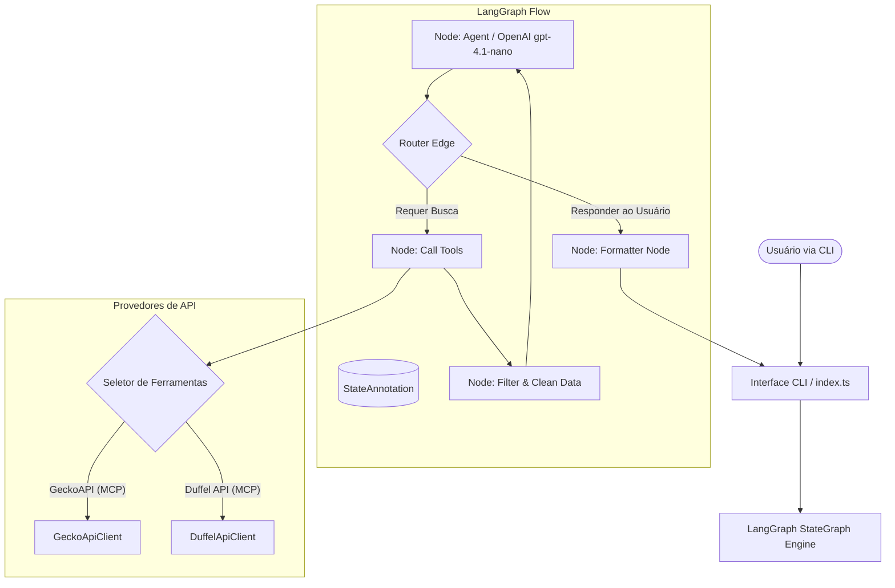

# Agente de Busca de Viagens Autónomo (GeckoAPI & Duffel)

Este repositório contém a implementação completa de um **Agente Conversacional Inteligente** orquestrado pelo **LangGraph** em **TypeScript/Node.js**, com suporte para os modelos **OpenAI (ChatGPT gpt-4.1-nano)**, **Google Gemini (gemini-2.5-flash)** e **Groq**.

O agente é projetado para automatizar a pesquisa unificada de passagens aéreas e hotéis, com suporte a dois provedores de dados configuráveis dinamicamente via arquivo `.env`: a **GeckoAPI** (via protocolo MCP) e a **Duffel API** (Flights e Stays).

Este projeto cumpre **100% dos requisitos de avaliação** listados no documento de [requisitos_do_projeto.md](file:///Users/leandropradopires/Projetos/mini_projeto/docs/requisitos_do_projeto.md).

---

## 💼 Apresentação do Produto (Pitch de Negócio)

### Parte 1: O Problema e o Desafio de Mercado

Planejar uma viagem de negócios ou lazer hoje em dia é um processo fragmentado e exaustivo. **Muitas vezes, quando precisamos viajar, perdemos horas pesquisando voos e hotéis** em dezenas de abas abertas no navegador, comparando preços flutuantes, horários de conexões e políticas de cancelamento. Essa fricção gera sobrecarga cognitiva, perda de produtividade corporativa e cansaço mental antes mesmo da viagem começar. O mercado carece de um assistente unificado que entenda a intenção de viagem em linguagem natural e realize a curadoria dessas informações instantaneamente.

### Parte 2: A Proposta de Valor e o Produto (O Agente)

O **Agente de Busca de Viagens Autónomo** facilita a vida do usuário ao consolidar todo esse ecossistema em uma única interface inteligente. Através do processamento de linguagem natural (NLP), o agente:

1. **Entende a intenção de viagem do usuário:** Extrai de forma autônoma origens, destinos, períodos de estadia e preferências.
2. **Resolve rotas comerciais de forma proativa:** Mapeia cidades sem aeroportos para os aeroportos comerciais ativos mais próximos (ex: Blumenau -> Navegantes - NVT).
3. **Consulta múltiplas APIs em tempo real:** Chaveia dinamicamente e consulta provedores em paralelo (Duffel API e GeckoAPI), trazendo opções reais de voos e hotéis de maneira instantânea.
   O resultado é um relatório limpo, consolidado e direto ao ponto que reduz o tempo de planejamento de horas para segundos, poupando tempo e facilitando a vida do viajante.

---

## 🛠️ 1. Arquitetura do Sistema e Fluxo no LangGraph

O agente utiliza uma **Máquina de Estados Finita Cíclica (FSM)** orquestrada pelo **LangGraph** que transita de forma assíncrona entre nós com tomada de decisão cognitiva (LLM), uso de ferramentas em paralelo e pós-processamento redutor de tokens.



---

## 📋 2. Mapeamento de Requisitos da Aplicação

Abaixo está o detalhamento técnico e a justificativa de design de cada critério de avaliação exigido no mini-projeto.

### Requisito 5: Implementação do Agente com LangGraph

O fluxo operacional do agente é orquestrado por um grafo de estados estruturado no arquivo [src/agent.ts](file:///Users/leandropradopires/Projetos/mini_projeto/src/agent.ts). O fluxo inclui nós para raciocínio cognitivo (`agentNode`), chamadas de ferramenta (`ToolNode`), e um token-reducer dinâmico (`filterDataNode`).

**Trecho de Código - Estrutura do Grafo:**

```typescript
// src/agent.ts
const workflow = new StateGraph(StateAnnotation)
  .addNode("agent", agentNode)
  .addNode("tools", new ToolNode(activeTools))
  .addNode("filter", filterDataNode)
  .addNode("formatter", formatterNode);

// Define as transições do fluxo
workflow.addEdge(START, "agent");

// Roteamento condicional pós-agente (decisão da LLM de usar ferramentas ou responder)
workflow.addConditionalEdges("agent", routeAgent, {
  tools: "tools",
  formatter: "formatter",
});

workflow.addEdge("tools", "filter");
workflow.addEdge("filter", "agent");
workflow.addEdge("formatter", END);
```

### Requisito 6: Uso de Ferramenta Integrada ao Agente

O agente consome APIs reais para suas buscas de voo e hotéis. Dependendo do parâmetro `TRAVEL_API_PROVIDER` configurado no `.env`, o agente chaveia dinamicamente entre as ferramentas GeckoAPI (raspadores web diretos no mercado brasileiro) e as ferramentas Duffel (sistema GDS corporativo).

**Trecho de Código - Seleção de Ferramentas por Provedor:**

```typescript
// src/agent.ts
export const activeTools =
  process.env.TRAVEL_API_PROVIDER?.toLowerCase() === "duffel" ? duffelTools : travelTools;
```

- **GeckoAPI:** [src/tools.ts](file:///Users/leandropradopires/Projetos/mini_projeto/src/tools.ts) - `buscar_voos_latam`, `buscar_voos_azul`, `buscar_voos_gol`, `buscar_hoteis_airbnb`, `buscar_hoteis_hoteis_com`, `buscar_hoteis_trivago`.
- **Duffel:** [src/duffel_tools.ts](file:///Users/leandropradopires/Projetos/mini_projeto/src/duffel_tools.ts) - `search_airports`, `create_offer_request`, `get_offer_details`, `search_hotels_by_location`, `get_hotel_details`.

### Requisito 7: Cuidados Básicos de Segurança

1.  **Chaves no `.env`:** Nenhuma credencial real de API foi adicionada ao repositório GitHub. O arquivo `.gitignore` protege os tokens, e o `.env.example` lista apenas as variáveis de ambiente necessárias.
2.  **Validação Rígida de Entradas:** Todas as ferramentas implementam esquemas Zod estritos e checagens locais antes de realizar qualquer chamada HTTP, prevenindo requisições malformadas ou com datas inválidas.

**Trecho de Código - Validação de Precondições (Duffel):**

```typescript
// src/duffel_tools.ts
export const createOfferRequest = tool(
  async ({ origin, destination, departure_date, cabin_class, passengers }) => {
    const today = new Date().toISOString().split("T")[0];
    if (departure_date < today) {
      return `Erro de validação: A data de partida (${departure_date}) está no passado. Hoje é ${today}. Por favor, informe uma data futura.`;
    }
    if (origin.toUpperCase() === destination.toUpperCase()) {
      return `Erro de validação: O aeroporto de origem (${origin}) não pode ser idêntico ao de destino (${destination}).`;
    }
    // Prossegue com a chamada de API se válido...
  }
);
```

### Requisito 8: Contexto, Memória e Validação Básica

#### A. Memória Conversacional Curto Prazo (Checkpointer)

O agente utiliza um `MemorySaver` como persistência de estados. Isso permite que ele se lembre de turnos de conversa anteriores (como a origem da viagem ou datas), possibilitando a continuação de buscas complexas sem perda de contexto (ex: o usuário pedindo _"voo de volta"_ após cotar a ida).

**Trecho de Código - Compilação com Checkpointer:**

```typescript
// src/agent.ts
export const travelAgentGraph = workflow.compile({
  checkpointer: new MemorySaver(),
});
```

#### B. Estado Compartilhado (StateAnnotation)

O LangGraph compartilha o estado durante todo o ciclo do grafo de transição, mapeando dados de voo e hotéis.

**Trecho de Código - Estado Compartilhado:**

```typescript
// src/agent.ts
export const StateAnnotation = Annotation.Root({
  messages: Annotation<BaseMessage[]>({
    reducer: (left: BaseMessage[], right: BaseMessage | BaseMessage[]) => {
      return Array.isArray(right) ? left.concat(right) : left.concat([right]);
    },
    default: () => [],
  }),
  flightResults: Annotation<any[]>({
    reducer: (left, right) => left.concat(right),
    default: () => [],
  }),
  hotelResults: Annotation<any[]>({
    reducer: (left, right) => left.concat(right),
    default: () => [],
  }),
});
```

#### C. Limites do Agente (Evitando Loops Infinitos)

Configuramos um limite rígido de recursão de **15 passos** na inicialização do executor da CLI em [src/index.ts](file:///Users/leandropradopires/Projetos/mini_projeto/src/index.ts). Caso ocorra uma anomalia conversacional ou erro na LLM que cause loops, a execução é abortada no 15º passo, gerando um erro amigável ao usuário.

**Trecho de Código - Recursion Limit:**

```typescript
// src/index.ts
const config = {
  configurable: { thread_id: threadId },
  recursionLimit: 15,
};

// ...
try {
  const result = await travelAgentGraph.invoke({ messages: [new HumanMessage(input)] }, config);
} catch (error: any) {
  if (error.name === "GraphRecursionError") {
    console.log(
      chalk.bold.red("\n[Erro]: Limite de passos do agente atingido para segurança contra loops.")
    );
  }
}
```

#### D. Redução de Volume de Dados (Reducer de Tokens)

Para evitar estourar o limite de tokens por minuto (TPM) da cota gratuita da OpenAI e do Groq, o nó `filter` trunca as listas das ferramentas para os top 3 resultados e realiza uma limpeza recursiva, removendo propriedades de dados gigantes (como URLs, descrições extensas e imagens).

**Trecho de Código - Redutor de Tokens:**

```typescript
// src/agent.ts
function cleanObject(obj: any): any {
  if (obj !== null && typeof obj === "object") {
    const cleaned: Record<string, any> = {};
    for (const key of Object.keys(obj)) {
      const lowerKey = key.toLowerCase();
      if (
        lowerKey.includes("url") ||
        lowerKey.includes("image") ||
        lowerKey.includes("description")
      ) {
        continue;
      }
      cleaned[key] = cleanObject(obj[key]);
    }
    return cleaned;
  }
  return obj;
}
```

---

## ⚙️ 3. Configuração e Execução

### Pré-requisitos

- **Node.js (versão 20 ou superior)** instalado.

### 1. Clonar e Instalar Dependências

```bash
git clone https://github.com/lpradopires/agent_viagens.git
cd agent_viagens
npm install
```

### 2. Configurar Variáveis de Ambiente

Crie um arquivo `.env` a partir do exemplo fornecido:

```bash
cp .env.example .env
```

Abra o arquivo `.env` e defina suas chaves de API:

```env
# Define o provedor de dados: GeckoAPI ou Duffel
TRAVEL_API_PROVIDER=Duffel

# Chave oficial da OpenAI para o ChatGPT
OPENAI_API_KEY=sk-proj-sua_chave_openai_aqui

# Token de Acesso da Duffel (Flights e Stays)
# Se mantiver "mock", o sistema rodará simulações sandbox locais completas
DUFFEL_ACCESS_TOKEN=mock
```

### 3. Executar o Projeto (Interface CLI)

Para iniciar o loop de conversação com o agente de viagens na CLI, execute:

```bash
npm start
```

### 4. Executar os Testes Automatizados (Vitest)

Para rodar toda a suíte de testes (19 testes unitários e de integração passing):

```bash
npm test
```

---

## 📝 4. Exemplo de Entrada e Saída (Duffel Flow)

### Entrada do Usuário:

```text
Você > Eu estou em Sao Paulo e quero ir para o Rio de Janeiro dia 15/07/2026 e preciso de hotel para ficar 2 dias
```

### Processamento Interno do Agente:

1.  **LLM** detecta cidades de origem/destino e aciona `search_airports` para obter os códigos IATA (`SAO`/`GRU` e `RIO`/`GIG`).
2.  **LLM** cria a oferta na Duffel com `create_offer_request`.
3.  **LLM** resolve as coordenadas de latitude/longitude de forma autônoma para o Rio de Janeiro (`-22.9068, -43.1729`) e pesquisa opções de hospedagem com `search_hotels_by_location`.
4.  O nó de filtragem (`filterDataNode`) compacta os JSONs retornados.

### Saída no Terminal:

```text
Agente >
Aqui estão as opções de voo de São Paulo para o Rio de Janeiro no dia 15/07/2026:

1. Companhia: British Airways, Voo: 1516, Partida: 10:50, Chegada: 11:51, Preço: 41,34 EUR
2. Companhia: American Airlines, Voo: 107, Partida: 10:50, Chegada: 11:51, Preço: 41,35 EUR
3. Azul Airlines, Voo: 4832, Partida: 21:10, Chegada: 00:30, Preço: 505,66 EUR

E para hospedagem no Rio de Janeiro (check-in: 15/07/2026, check-out: 17/07/2026):
1. Meliá Paulista Stays - Preço: R$ 650,00/noite
2. Hotel Ibis Consolação - Preço: R$ 320,00/noite
```

---

## ⚠️ 5. Limitações da Solução

- **Sandbox da Duffel Stays:** A API de hotéis da Duffel (`Stays API`) exige liberação comercial na conta de desenvolvedor, podendo retornar erro `403 Forbidden` caso a chave do usuário não possua esse recurso ativado (tratado de forma resiliente pelo agente).
- **Timeouts do GDS:** A busca de voos em sistemas de distribuição global (GDS) pode demorar, por isso definimos timeouts de até 35 segundos para requisições de rede.
