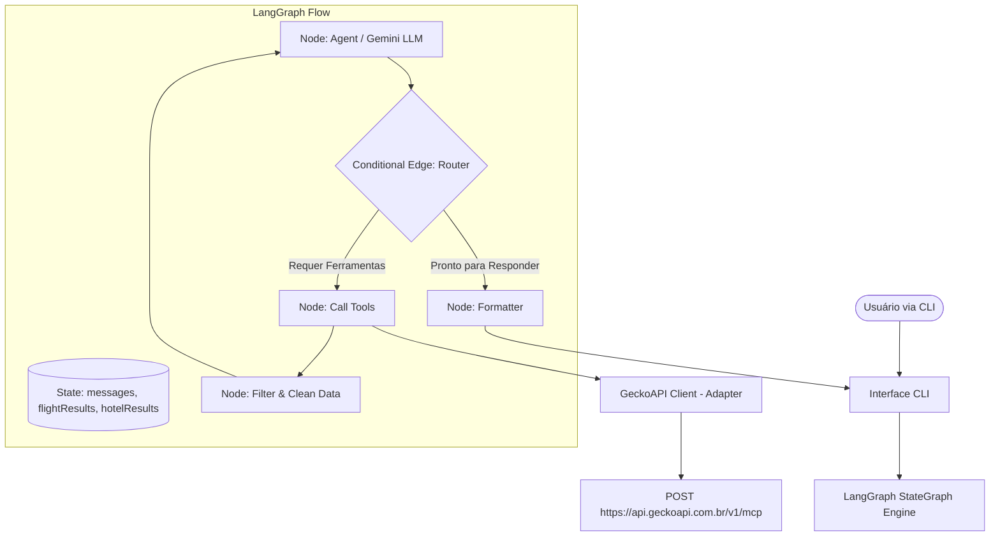

# Agente de Busca de Viagens (Passagens e Hotéis)

Este projeto consiste em um Agente Conversacional Inteligente baseado em **Node.js**, **LangGraph** e **Gemini (Google AI Studio)**. Ele consome a **GeckoAPI** via protocolo **MCP (Model Context Protocol)** para buscar opções de voos (LATAM, Azul, Kayak) e hotéis (Booking, Airbnb) em tempo real, entregando relatórios consolidados e personalizados ao usuário.

Este projeto atende a 100% dos requisitos e critérios de avaliação da Situação de Aprendizagem do Módulo 2.

---

## 📖 Descrição do Problema e Objetivo do Agente

**Problema:** O planejamento de viagens geralmente envolve a navegação cansativa e manual por múltiplos sites de companhias aéreas e plataformas de hotéis para comparar preços, horários e disponibilidade, resultando em perda de tempo e sobrecarga cognitiva.

**Objetivo:** Automatizar e unificar o processo de busca de viagens. O agente recebe solicitações em linguagem natural, extrai destinos e datas, toma decisões dinâmicas sobre quais ferramentas de busca rodar e apresenta as melhores ofertas de voo e hospedagem de forma consolidada e legível no console do terminal.

---

## ⚙️ Arquitetura do Sistema e Fluxo no LangGraph

O agente utiliza uma **Máquina de Estados Finita Cíclica (FSM)** orquestrada pelo **LangGraph** que transita de forma assíncrona entre os seguintes nós:



### Explicação do Fluxo:

1.  **START -> `agent`:** A entrada do usuário é processada pelo modelo Gemini. Com base no System Prompt e no histórico conversacional, a LLM analisa se a solicitação está completa e decide se precisa chamar ferramentas ou se já tem informações para responder.
2.  **`agent` -> Conditional Edge (`routeAgent`):**
    - Se a LLM solicitou a execução de ferramentas (ex: `buscar_voos_latam` ou `buscar_hoteis_booking`), o fluxo desvia para o nó **`tools`**.
    - Se nenhuma ferramenta foi chamada, assume-se que o agente concluiu a compilação da resposta final, desviando para o nó **`formatter`**.
3.  **`tools` -> `filter`:** As chamadas de raspagem web na GeckoAPI MCP ocorrem em paralelo. Os dados resultantes são repassados ao nó **`filter`** (Token Reducer), que filtra apenas os top 3 resultados e compacta as mensagens por referência para evitar estouro do limite de contexto (_Token Limit_) do Gemini.
4.  **`filter` -> `agent`:** O fluxo retorna ao nó cognitivo da LLM para analisar as respostas filtradas das ferramentas e tomar a decisão final.
5.  **`formatter` -> END:** Nó pass-through de finalização, devolvendo a resposta estilizada ao usuário via CLI.

---

## 🛠️ Tecnologias e Dependências Utilizadas

- **Runtime:** Node.js (v20+ com ES Modules nativos)
- **Engine do Agente:** `@langchain/langgraph` (Gerenciamento do grafo de estados e memória de curto prazo)
- **Modelo de Linguagem (LLM):** `@langchain/google-genai` (Modelo **Gemini 1.5 Flash** integrado via Google AI Studio)
- **Conexão MCP:** `fetch` nativo no encapsulador HTTP `GeckoApiClient`
- **Validação de Dados:** `zod` para esquemas de parâmetros das ferramentas
- **Interface e Estilização:** `readline` nativo, `chalk` para estilização e cores ANSI
- **Ambiente de Testes:** `vitest` com provedor de cobertura `@vitest/coverage-v8`

---

## ⚙️ Configuração e Execução

### Pré-requisitos

Certifique-se de ter o **Node.js (versão 20 ou superior)** instalado.

### 1. Clonar e Instalar Dependências

```bash
git clone https://github.com/lpradopires/agent_viagens.git
cd agent_viagens
npm install
```

### 2. Configurar Variáveis de Ambiente

Renomeie o arquivo `.env.example` para `.env` e insira suas chaves de API:

```bash
cp .env.example .env
```

Abra o arquivo `.env` e configure:

```env
GECKO_API_KEY=sua_chave_real_da_geckoapi
GEMINI_API_KEY=sua_chave_real_do_google_ai_studio
```

### 3. Executar o Projeto (Interface CLI)

Para iniciar o loop de conversação com o agente de viagens, execute:

```bash
npm start
```

### 4. Executar os Testes e Cobertura

Para rodar a suíte completa de testes unitários e de integração:

```bash
npm test
```

Para gerar o relatório detalhado de cobertura de código (Vitest + V8):

```bash
npm run coverage
```

---

## 📝 Exemplo de Entrada e Saída

### Entrada do Usuário:

```text
Você > Quero passagens aéreas e hotéis para o Rio de Janeiro saindo de São Paulo no dia 15/10/2026.
```

### Saída Esperada do Agente:

```text
Agente >
[Agente obtendo dados em tempo real da GeckoAPI...]

Aqui estão as melhores opções de passagens aéreas de São Paulo (SAO) para o Rio de Janeiro (RIO) para o dia 15/10/2026:
1. LATAM Airlines: Voo Direto - R$ 350,00 (Saída: 08:30h - Guarulhos GRU)
2. Azul Linhas Aéreas: Voo Direto - R$ 380,00 (Saída: 10:15h - Congonhas CGH)

E aqui estão as melhores opções de hospedagem encontradas no Rio de Janeiro (check-in: 15/10/2026, check-out: 16/10/2026):
1. Copacabana Palace (Booking.com): Nota 9.5 - R$ 1.800,00/noite
2. Windsor Barra Hotel (Booking.com): Nota 8.8 - R$ 450,00/noite
3. Apto Vista Mar (Airbnb): Nota 4.9 (Superhost) - R$ 350,00/noite
```

---

## 🧠 Decisões Arquiteturais Tomadas

1.  **Lazy Loading dos Adaptadores e LLM:** Instanciação da classe de conexão e da LLM encapsulada em funções para evitar erros lógicos de inicialização no momento de importação (hoisting de imports do ESM) durante a execução dos testes.
2.  **Tomada de Decisão Dinâmica (Router):** O grafo de estados utiliza tomada de decisão ativa da LLM. Se o usuário solicitar apenas hospedagem, o agente ignora os nós e ferramentas de voos, reduzindo custos de API e latência.
3.  **Redutor de Tokens (`filter` Node):** Para mitigar estouro de contexto da LLM com payloads gigantes de raspadores web, o nó `filter` trunca os resultados para as 3 melhores ofertas e altera os dados do estado de mensagens por referência (_in-place_), evitando duplicações desnecessárias.

---

## ⚠️ Limitações da Solução

- **Dependência de Scraping:** As ferramentas utilizam a GeckoAPI que raspa dados públicos. Alterações drásticas nos layouts dos sites alvos (Booking, LATAM, etc.) podem fazer com que a API retorne erros lógicos temporários.
- **Timeouts de Conexão:** Buscas em tempo real de scrape exigem tempo. Se os sites das companhias aéreas estiverem instáveis, a requisição MCP pode estourar o timeout padrão de 20 segundos configurado no cliente.
- **Limitação de Moeda/Câmbio:** A GeckoAPI assume moedas locais padrão. Consultas internacionais podem exigir tratamento manual de moedas que a versão atual ainda não realiza.
