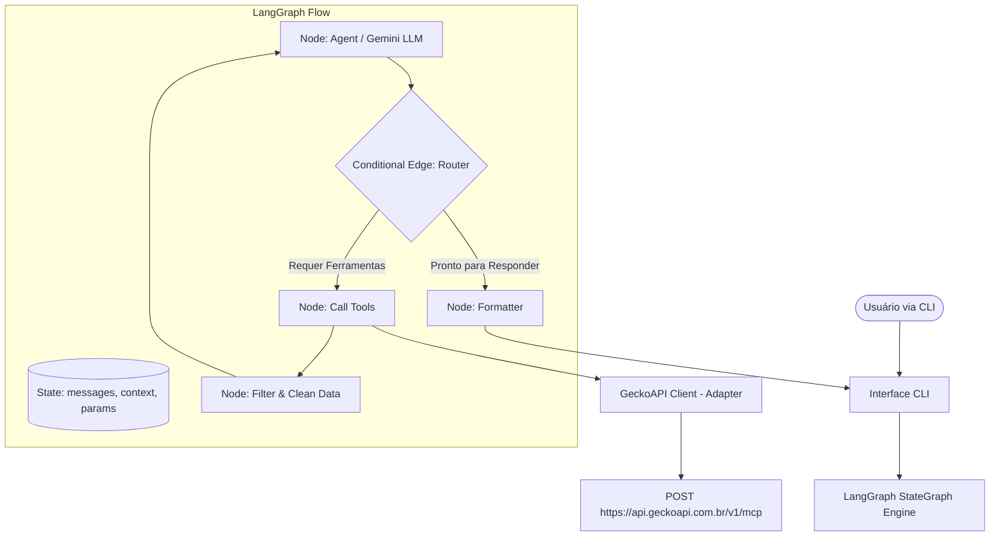

# Documento de Arquitetura do Sistema

**Projeto:** Agente de Busca de Viagens (Passagens e Hotéis)  
**Tecnologias:** Node.js, LangGraph, Gemini (Google AI Studio) e GeckoAPI MCP  
**Autor:** Arquiteto de Sistemas Sênior  

---

## 1. Visão Geral da Arquitetura

O sistema é baseado em uma arquitetura de agente conversacional autônomo e reativo, estruturado em torno do framework **LangGraph** no ecossistema Node.js. O processamento cognitivo é delegado ao modelo **Gemini (Google AI Studio)** via SDK `@langchain/google-genai`. A extração de dados em tempo real é efetuada através de chamadas seguras para a **GeckoAPI** utilizando o protocolo **MCP (Model Context Protocol)**.



---

## 2. Componentes do Sistema

A solução está dividida em quatro componentes independentes e fracamente acoplados:

1. **Camada de Apresentação (CLI - Command Line Interface):**
   * Responsável por capturar a entrada textual do usuário no terminal.
   * Inicializa o loop de interação contínua.
   * Renderiza a saída gerada pelo agente utilizando tabelas e estilização ANSI (via `chalk` e `cli-table3`) para melhor legibilidade.

2. **Motor de Orquestração (LangGraph StateGraph):**
   * Orquestra a execução das tarefas através de um grafo cíclico direcionado (DAG com loops).
   * Mantém a memória compartilhada da sessão conversacional (o Estado).
   * Define regras de transição de nós usando decisões lógicas (Edges e Conditional Edges).

3. **Camada Cognitiva (Gemini LLM):**
   * Processa a entrada do usuário para entender a intenção conversacional.
   * Realiza a extração de entidades estruturadas (origem, destino, data) em linguagem natural.
   * Decide de maneira autônoma e dinâmica quais ferramentas acionar e com quais parâmetros.
   * Interpreta os dados brutos filtrados e consolida as respostas finais.

4. **Adaptador de Ferramentas Externas (GeckoAPI MCP Client):**
   * Encapsula as chamadas HTTP para o endpoint `/v1/mcp` da GeckoAPI.
   * Modela e injeta os parâmetros em payloads no formato JSON-RPC 2.0.
   * Valida as entradas das ferramentas com schemas `Zod` e trata erros HTTP e lógicos (`isError: true`).

---

## 3. Padrões de Projeto (Design Patterns)

*   **State Pattern / Finite State Machine (FSM):** Implementado nativamente pelo `StateGraph` da LangGraph. O estado evolui através de mutações controladas de nó em nó, garantindo previsibilidade e rastreabilidade total de execução.
*   **Tool Calling / Function Calling Pattern:** O Gemini gera uma intenção de execução de ferramenta (`tool_calls`), a qual é mapeada diretamente para uma chamada de função real em JS. O fluxo aguarda a execução e injeta o resultado de volta como uma mensagem especial de ferramenta (`ToolMessage`).
*   **Adapter Pattern:** A classe `GeckoApiClient` atua como um adaptador que converte a interface de chamadas RPC da GeckoAPI no padrão de classes `StructuredTool` da LangChain, isolando a complexidade do protocolo de transporte (HTTP POST com JSON-RPC) das regras do grafo.

---

## 4. Estrutura do Estado e Fluxo de Dados

### 4.1. Definição do Estado (`AgentState`)

O estado transita entre todos os nós e armazena os seguintes dados:

```typescript
import { BaseMessage } from "@langchain/core/messages";

export interface AgentState {
  // Histórico completo de mensagens da conversa (mensagens do usuário, LLM e ferramentas)
  messages: BaseMessage[];
  
  // Parâmetros extraídos da solicitação do usuário
  parameters: {
    origin?: string;
    destination?: string;
    date?: string;
  };
  
  // Lista de resultados normalizados obtidos
  flightResults: any[];
  hotelResults: any[];
  
  // Lista de erros acumulados durante a execução
  errors: string[];
}
```

### 4.2. Funcionamento dos Nós (Nodes)

1.  **Nó do Agente (`Agent Node`):**
    *   **Entrada:** Estado atual com histórico de mensagens.
    *   **Ação:** Executa chamada ao Gemini com o System Prompt estruturado. O prompt injeta a data de hoje para resolver termos como "amanhã" e define o formato esperado. O modelo retorna um objeto de mensagem com ou sem requisição de ferramentas (`tool_calls`).
    *   **Saída:** Atualiza o estado anexando a mensagem do LLM.
2.  **Nó de Execução de Ferramentas (`Call Tools Node`):**
    *   **Entrada:** Estado contendo mensagens com solicitações de `tool_calls`.
    *   **Ação:** Dispara paralelamente as chamadas HTTP para o endpoint da GeckoAPI com o envelopamento JSON-RPC 2.0 correspondente para cada ferramenta invocada.
    *   **Saída:** Adiciona as mensagens de ferramenta (`ToolMessage`) contendo os payloads brutos de resposta no histórico de mensagens.
3.  **Nó de Filtragem e Limpeza (`Filter Data Node` - Token Reducer):**
    *   **Entrada:** Estado contendo as respostas brutas das ferramentas.
    *   **Ação:** Intercepta as strings JSON das ferramentas. Faz o parse, filtra apenas as 3 melhores ofertas com menor preço, remove dados supérfluos (como logs de scraping, URLs longas de imagens, tokens de rastreamento) e reconverte para uma estrutura compacta.
    *   **Saída:** Substitui o conteúdo volumoso das `ToolMessage` por versões sintetizadas e atualiza os arrays `flightResults` e `hotelResults` no estado.
4.  **Nó de Formatação (`Formatter Node`):**
    *   **Entrada:** Estado consolidado.
    *   **Ação:** Gera uma resposta final em Markdown formatando os dados de voo e hotel em uma tabela comparativa elegante com recomendações.
    *   **Saída:** Retorna a mensagem final ao usuário.

### 4.3. Fluxo de Dados Dinâmico (Router Edge)

Ao sair do **Nó do Agente**, a transição é avaliada por uma *Conditional Edge* (Router):
*   Se a última mensagem contiver solicitações de `tool_calls` pendentes, o fluxo é desviado para o **Nó de Execução de Ferramentas**.
*   Se a última mensagem não contiver solicitações de ferramentas (o agente decidiu que já possui dados suficientes para responder), o fluxo é desviado para o **Nó de Formatação**, encerrando a execução do ciclo de busca.

---

## 5. Protocolo de Integração com a GeckoAPI

As ferramentas executam chamadas HTTP POST para o endpoint único de MCP.

### Estrutura do Envelope JSON-RPC 2.0 (Request)
```json
{
  "jsonrpc": "2.0",
  "method": "tools/call",
  "params": {
    "name": "booking_com_br_plp",
    "arguments": {
      "keyword": "Rio de Janeiro",
      "checkin": "2026-08-01",
      "checkout": "2026-08-08"
    }
  },
  "id": 1
}
```

### Estrutura da Resposta Esperada (Response)
```json
{
  "jsonrpc": "2.0",
  "id": 1,
  "result": {
    "content": [
      {
        "type": "text",
        "text": "[...JSON dos dados raspados em formato string...]"
      }
    ],
    "isError": false
  }
}
```

---

## 6. Considerações de Segurança, Memória e Escalabilidade

### 6.1. Segurança das Credenciais
*   A inicialização do sistema valida a presença das variáveis de ambiente `GEMINI_API_KEY` e `GECKO_API_KEY`. Se ausentes, o sistema falha imediatamente (*Fail-Fast*) com uma mensagem explicativa.
*   Em caso de erros de requisição HTTP, o adaptador intercepta e oculta chaves e dados de autenticação dos cabeçalhos antes de registrar os logs.
*   O arquivo `.env.example` serve como template obrigatório no repositório.

### 6.2. Gerenciamento de Memória Conversacional
*   O motor utiliza a classe `MemorySaver` para persistir o histórico do grafo.
*   A sessão conversacional é indexada por um identificador exclusivo (`thread_id`), permitindo ao usuário fazer consultas refinadas consecutivas (ex: *"Mude o destino para Salvador"* ou *"Ordene os hotéis pelo mais barato"*), mantendo o histórico.

### 6.3. Escalabilidade e Portabilidade
*   **Desacoplamento de UI:** O fluxo do LangGraph e o adaptador de APIs não possuem dependência de console/CLI. A lógica expõe uma função assíncrona limpa `runAgent(threadId, userInput)`.
*   Isso garante que a aplicação possa ser portada imediatamente para um servidor web (como Express/NestJS), uma fila de mensagens ou um webhook de chat sem nenhuma alteração na lógica interna do agente.
