# Plano de Tarefas de Desenvolvimento

**Projeto:** Agente de Busca de Viagens (Passagens e Hotéis)  
**Tecnologias:** Node.js, LangGraph, Gemini (Google AI Studio) e GeckoAPI MCP  
**Autor:** Arquiteto de Sistemas Sênior

---

Este documento apresenta o plano detalhado de tarefas para o desenvolvimento do Agente de Busca de Viagens, organizado de forma a garantir a progressão lógica, mitigação de riscos técnicos e atendimento completo dos critérios de avaliação do projeto.

---

## Estrutura de Atividades e Linha do Tempo

O desenvolvimento é estruturado em **7 tarefas sequenciais**. A ordem de execução respeita a árvore de dependências do sistema: o ambiente e o CI/CD são configurados primeiro, seguidos pelas ferramentas de integração com a API, o motor do agente no LangGraph, a interface de usuário e, finalmente, testes integrados e documentação de entrega.

```mermaid
gantt
    title Cronograma de Desenvolvimento do Agente
    dateFormat  D
    axisFormat %d

    section Setup & CI/CD
    Configuração do Ambiente e Padrões   :t1, 0, 1d
    Pipeline de CI/CD (GitHub Actions)    :t2, after t1, 1d

    section Integrações & Agente
    Adaptadores da GeckoAPI (Tools)       :t3, after t1, 2d
    Orquestrador LangGraph (Gemini)       :t4, after t3, 3d

    section Interface & Validação
    Interface CLI Interativa              :t5, after t4, 2d
    Testes e Validação Completa           :t6, after t5, 2d
    Documentação e Preparação da Entrega  :t7, after t6, 1d
```

---

## Detalhamento das Tarefas de Desenvolvimento

### Tarefa 1: Setup do Ambiente e Padrões de Código

- **Descrição:** Configuração do ambiente de desenvolvimento local, inicialização do repositório Git, estruturação do projeto com TypeScript e definição dos linters e regras de versionamento semântico obrigatório.
- **Escopo:**
  1.  Executar `npm init -y` e estruturar os diretórios do projeto (`src/`, `tests/`, `docs/`).
  2.  Instalar TypeScript e configurar o `tsconfig.json` para suporte a ES Modules (`ES2022`).
  3.  Instalar e configurar ESLint e Prettier para padronização de formatação.
  4.  Criar os arquivos `.gitignore` (ocultando `.env` e logs) e `.env.example`.
  5.  Configurar o `husky` e `commitlint` para validação local de mensagens de commit conforme o padrão Conventional Commits (ex: `feat:`, `fix:`, `docs:`, `chore:`).
  6.  Inicializar o repositório git local.
- **Dependências:** Nenhuma.
- **Estimativa de Esforço:** 4 horas.
- **Critérios de Conclusão (DoD):**
  - Comando `npm run build` transpila o código TypeScript para JavaScript sem erros.
  - Comando `npm run lint` executa e passa com sucesso.
  - O arquivo `.env.example` está criado na raiz contendo apenas os nomes das chaves de ambiente necessárias.
  - A tentativa de efetuar um commit com mensagem fora do padrão convencional (ex: "commit inicial") é bloqueada pelo Husky.

---

### Tarefa 2: Configuração da Infraestrutura de CI/CD

- **Descrição:** Configuração de uma esteira automatizada no GitHub Actions para garantir que todas as branches enviadas ao repositório sigam os padrões de qualidade e segurança antes do merge.
- **Escopo:**
  1.  Criar o diretório `.github/workflows/` e o arquivo `ci.yml`.
  2.  Escrever as instruções do job de CI para: instalar dependências, verificar lint (`npm run lint`), validar tipagem (`npx tsc --noEmit`) e rodar testes unitários/integração.
  3.  Configurar regras de proteção de branch no GitHub para a branch `main` (exigindo build passando no CI para autorizar o merge).
- **Dependências:** Tarefa 1.
- **Estimativa de Esforço:** 3 horas.
- **Critérios de Conclusão (DoD):**
  - Pull Requests enviados ao repositório GitHub disparam o workflow do Actions de forma automática.
  - O build do CI é executado e sinalizado em verde para alterações corretas.

---

### Tarefa 3: Implementação dos Adaptadores da GeckoAPI (Tools)

- **Descrição:** Criação da biblioteca cliente e encapsulamento das buscas de voos e hotéis da GeckoAPI no formato de ferramentas integráveis à LangChain.
- **Escopo:**
  1.  Implementar o cliente de conexão HTTP (usando `fetch` nativo do Node ou `axios`) para apontar para `POST https://api.geckoapi.com.br/v1/mcp` utilizando autenticação Bearer via variável de ambiente `GECKO_API_KEY`.
  2.  Desenhar e validar os esquemas de entrada para as ferramentas de voo (`latamairlines_com_plp`, `voeazul_com_br_plp`, `kayak_com_br_plp`) e hotel (`booking_com_br_plp`, `airbnb_com_br_plp`) utilizando a biblioteca **Zod**.
  3.  Implementar a classe adapter para formatar a chamada no protocolo JSON-RPC 2.0 (`method: "tools/call"`).
  4.  Escrever funções de tratamento de erros que validam o parâmetro `isError: true` no retorno da API e tratam falhas de conexão de rede de maneira resiliente.
- **Dependências:** Tarefa 1.
- **Estimativa de Esforço:** 8 horas.
- **Critérios de Conclusão (DoD):**
  - Testes unitários cobrindo os adaptadores de voos e hotéis criados (com mocks das chamadas HTTP usando `nock` ou similar).
  - As chamadas retornam dados estruturados corretamente ou devolvem mensagens de erro amigáveis, sem lançar exceções fatais na aplicação.

---

### Tarefa 4: Implementação do Engine LangGraph e Integração com Gemini

- **Descrição:** Implementação do motor do agente de viagem baseado em grafos de estado. O agente tomará decisões de busca dinâmicas usando o Gemini e guardará o histórico conversacional na memória.
- **Escopo:**
  1.  Instalar as dependências `@langchain/langgraph`, `@langchain/core` e `@langchain/google-genai`.
  2.  Definir a interface `AgentState` para controlar mensagens, parâmetros extraídos e resultados de busca.
  3.  Implementar o `Agent Node` inicializando o Gemini 1.5 Flash via `@langchain/google-genai` com um system prompt detalhado (injetando a data atual do sistema).
  4.  Implementar a lógica de tomada de decisão dinâmica (Router) usando _Conditional Edges_ ligando o agente às ferramentas registradas.
  5.  Implementar o `Call Tools Node` para disparar as execuções selecionadas pelo LLM.
  6.  Implementar o `Filter Data Node` (Token Reducer) para processar o JSON retornado pela GeckoAPI, filtrando apenas as 3 opções mais baratas e descartando metadados redundantes para evitar estouro de tokens.
  7.  Implementar o `Formatter Node` que reúne o estado e gera o relatório final em formato Markdown.
  8.  Configurar a persistência do estado conversacional usando `MemorySaver` da LangGraph.
- **Dependências:** Tarefa 3.
- **Estimativa de Esforço:** 12 horas.
- **Critérios de Conclusão (DoD):**
  - Execução ponta a ponta do grafo com sucesso em testes de integração locais.
  - Se o usuário solicita apenas voos, o grafo executa apenas a ferramenta de voos, pulando hotéis.
  - Se o usuário solicita alteração na data na mensagem seguinte, a memória recupera o contexto e repete as buscas com os novos parâmetros.

---

### Tarefa 5: Criação da Interface CLI Interativa

- **Descrição:** Desenvolvimento da interface de terminal para a interação do usuário com o agente conversacional.
- **Escopo:**
  1.  Criar o script de entrada em `src/index.ts` inicializando um loop interativo com o módulo `readline` ou a biblioteca `inquirer`.
  2.  Implementar prompt inicial solicitando: Cidade de Origem, Cidade de Destino e Data da Viagem.
  3.  Passar as mensagens do usuário para o grafo do LangGraph utilizando um `thread_id` exclusivo por execução.
  4.  Formatar e colorir as mensagens no console. Exibir as opções de passagens e hotéis em formato de tabelas estilizadas de terminal (usando `cli-table3` ou `chalk`).
- **Dependências:** Tarefa 4.
- **Estimativa de Esforço:** 6 horas.
- **Critérios de Conclusão (DoD):**
  - O comando `npm start` abre uma sessão interativa no console sem erros.
  - O relatório de opções de viagem é impresso de forma limpa e formatada no terminal do usuário.

---

### Tarefa 6: Testes, Cobertura e Validação Geral

- **Descrição:** Execução de testes de qualidade abrangentes e simulação de erros para garantir a robustez técnica exigida na nota do mini-projeto.
- **Escopo:**
  1.  Implementar testes integrados E2E usando `vitest` ou `jest`.
  2.  Escrever cenários de teste para: rede offline/GeckoAPI fora do ar, entradas de datas inválidas, e extrações textuais ambíguas.
  3.  Configurar ferramenta de cobertura de código (`c8` ou cobertura nativa do Vitest).
- **Dependências:** Tarefa 5.
- **Estimativa de Esforço:** 8 horas.
- **Critérios de Conclusão (DoD):**
  - Cobertura mínima de **80% de linhas de código** atingida em arquivos de lógica de negócio (`src/`).
  - Execução do conjunto completo de testes passa com sucesso localmente e no CI do GitHub.

---

### Tarefa 7: Documentação e Preparação para Entrega

- **Descrição:** Elaboração de toda a documentação explicativa exigida no edital do projeto para avaliação dos professores, além da auditoria final de segurança.
- **Escopo:**
  1.  Redigir o arquivo `README.md` detalhando: nome do projeto, descrição do problema, arquitetura do agente (LangGraph e componentes), ferramentas utilizadas, instruções de execução rápidas (`npm install` / `npm start`), exemplos reais de entrada/saída e principais decisões arquiteturais.
  2.  Gerar o arquivo `docs/prompts.md` listando os prompts de sistema estruturados utilizados na parametrização do Gemini.
  3.  Desenhar e exportar os 2 slides exigidos no edital em formato Markdown ou PDF (problema, agente, entrada, saída e visão geral do fluxo).
  4.  Auditar o histórico do git (`git log`) para garantir que nenhuma chave real da API do Gemini ou da GeckoAPI tenha sido persistida no repositório.
- **Dependências:** Tarefa 6.
- **Estimativa de Esforço:** 6 horas.
- **Critérios de Conclusão (DoD):**
  - Arquivos `README.md`, `docs/prompts.md` e os 2 slides salvos e empacotados na raiz do repositório.
  - Repositório clonado em máquina limpa roda com sucesso apenas configurando o `.env` a partir do `.env.example`.
